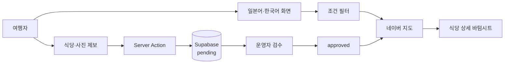

# 혼밥서울 (Honbab Seoul)

> 일본인 여행자가 서울에서 혼자 먹기 좋은 식당을 지도에서 찾고 제보하는 모바일 웹 앱

`혼밥서울`은 낯선 서울에서 혼자 식사할 곳을 찾는 일본인 여행자를 위해 만든 서비스입니다. 일본어 중심의 탐색 화면에서 혼밥 가능 여부, 일본어 메뉴, 심야 영업 조건으로 식당을 걸러 보고, 지도 핀을 눌러 가격대·주소·사진·네이버 지도 링크를 확인할 수 있습니다.

**현재 상태:** MVP 핵심 기능 구현 · 프로덕션 공개 준비 중

## 해결하려는 문제

여행 중 혼자 식사할 식당을 찾을 때는 일반 맛집 목록만으로 판단하기 어렵습니다.

- 혼자 입장하기 편한지 알기 어렵다.
- 일본어 메뉴와 늦은 시간 영업 여부가 여러 서비스에 흩어져 있다.
- 한국어 상호·주소를 일본어 사용자에게 맞게 다시 해석해야 한다.
- 사용자 제보를 바로 공개하면 잘못된 정보나 부적절한 이미지가 노출될 수 있다.

혼밥서울은 여행자에게 필요한 조건만 빠르게 비교할 수 있는 지도와, 운영자 검수를 거치는 제보 흐름을 하나로 연결합니다.

## 핵심 기능

| 영역 | 제공 기능 |
| --- | --- |
| 다국어 탐색 | 일본어 기본 경로(`/ja`)와 한국어 경로(`/ko`), 언어별 상호·주소 표시 |
| 지도 검색 | 네이버 지도 마커·클러스터, 혼밥·일본어 메뉴·심야 영업 필터 |
| 식당 상세 | 모바일 바텀시트에서 가격대, 배지, 사진, 주소 복사, 네이버 지도 링크 제공 |
| 사용자 제보 | 식당 정보와 사진을 제출하고 실패 시 입력 내용을 복원 |
| 운영자 검수 | 제보를 `pending` 상태로 저장하고 승인된 식당만 공개 |
| 검색·공유 대응 | Open Graph 이미지, 웹 앱 manifest, robots, sitemap 자동 생성 |

## 사용자 흐름



## 설계에서 신경 쓴 부분

### 승인된 데이터만 공개

공개 조회는 Supabase RLS와 애플리케이션 쿼리 양쪽에서 `status = approved`를 확인합니다. 새 제보는 서버 전용 키를 사용하는 경로에서만 `pending`으로 저장되며, 운영자가 승인하기 전에는 공개 지도에 나타나지 않습니다.

### 업로드와 저장 실패를 함께 처리

사진을 먼저 업로드한 뒤 데이터베이스 저장이 실패하면 업로드된 객체를 정리합니다. 파일 형식과 크기는 클라이언트와 서버에서 각각 검증하고, 오류가 발생해도 사용자가 작성한 입력값은 짧은 수명의 HTTP-only 쿠키로 복원합니다.

### 외부 서비스 장애에 대비

네이버 지도 SDK는 로딩 실패 시 사용자 메시지를 표시하는 경계 안에서 실행합니다. 선택 기능인 네이버 지역 검색 보강이 실패하거나 결과가 모호해도 제보 자체는 계속 저장되도록 분리했습니다.

### 모바일 중심의 다국어 UI

지도에서 마커를 선택하면 작은 화면에 맞춘 바텀시트가 열립니다. 식당명과 주소는 현재 언어를 우선하고 다른 언어를 보조 정보로 사용해, 일본어 데이터가 일부 비어 있어도 탐색이 끊기지 않게 했습니다.

## 기술 스택

| 구분 | 기술 |
| --- | --- |
| 프론트엔드 | Next.js 15, React 19, TypeScript, Tailwind CSS 4 |
| 다국어 | next-intl |
| 지도 | Naver Maps JavaScript API |
| 데이터·스토리지 | Supabase Postgres, RLS, Storage |
| 입력 검증 | Zod |
| 테스트 | Vitest, Testing Library, Playwright |
| 배포 | Vercel |

## 로컬 실행

Node.js와 `pnpm`이 필요합니다.

```bash
git clone https://github.com/0xMegg/honbabseoul.git
cd honbabseoul
pnpm install
cp .env.local.example .env.local
pnpm dev
```

`.env.local`에 다음 값을 설정합니다.

| 환경 변수 | 용도 |
| --- | --- |
| `NEXT_PUBLIC_SUPABASE_URL` | Supabase 프로젝트 URL |
| `NEXT_PUBLIC_SUPABASE_PUBLISHABLE_KEY` | RLS가 적용되는 공개 클라이언트 키 |
| `SUPABASE_SECRET_KEY` | 제보 저장에만 사용하는 서버 전용 키 |
| `NEXT_PUBLIC_NAVER_MAPS_CLIENT_ID` | 네이버 지도 JavaScript SDK 키 |

네이버 지역 검색을 이용한 상호·주소·좌표 보강은 선택 기능입니다. `NAVER_SEARCH_CLIENT_ID`와 `NAVER_SEARCH_CLIENT_SECRET`을 설정하지 않아도 제보 흐름은 동작합니다. 전체 설정과 레거시 키는 [`.env.local.example`](.env.local.example)을 참고하세요.

로컬 지도 표시에는 `http://localhost:3000`을 네이버 지도 허용 도메인에 추가하고 `NEXT_PUBLIC_NAVER_MAPS_ALLOW_LOCALHOST=true`로 설정해야 합니다.

## 검증

```bash
pnpm lint
pnpm test
pnpm build
pnpm test:e2e
```

단위·컴포넌트 테스트는 공개 데이터 필터, 지도와 상세 화면, 제보 검증·저장·사진 정리 경로를 다룹니다. Playwright 테스트는 로컬 사용자 흐름과, 명시적으로 활성화했을 때만 실행되는 배포 환경 smoke test로 나뉩니다.

## 프로젝트 상태

핵심 제품 흐름은 구현되어 있지만 공개 프로덕션 출시는 아직 준비 중입니다. 다음 항목을 마친 뒤 실제 서비스 링크를 공개할 예정입니다.

- 프로덕션 전용 Supabase 프로젝트 분리
- 실제 검수된 식당 데이터 20곳 준비
- 커스텀 도메인 연결과 네이버 지도 허용 도메인 등록
- 공개 환경에서 지도·제보·승인 흐름 최종 점검

자세한 운영 절차는 [배포 가이드](docs/deployment.md)와 [승인 워크플로](docs/admin-workflow.md)에 정리되어 있습니다. 저장소의 협업·검증 규칙은 [AGENTS.md](AGENTS.md)에서 확인할 수 있습니다.
